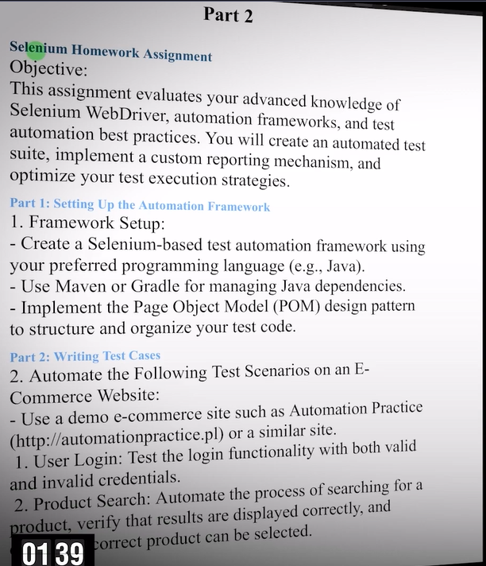
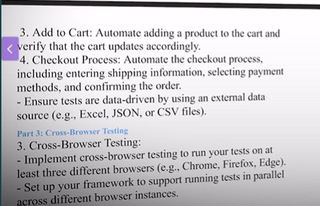
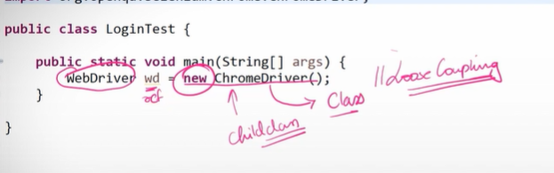
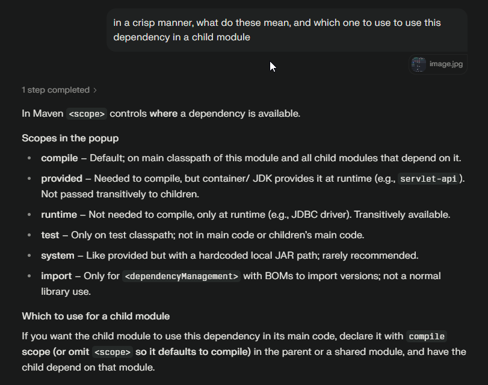

This is what i am trying to solve as part of this assignment

TO DO:
* Clean code
* Design patterns - Singleton, Factory, Page Object
* Reports - Extent/Allure
* Logging - Log4J
* Data driven
  * Excel - Apache POI
  * Json - JsonPath
  * CSV - Open CSV
* Cross browser testing
  * Run tests on Chrome,Firefox, Edge
* Framework to have the capability to run tests in parallel
* Code quality - Sonar
* Retry Logic - IRetry Analyzer
* Run the framework in Dev,QA, UAT environments
* Utility components for reusability
* Run the framework from terminal using surefire plugin and integrate it with CICD
* Headless option - to run in Github Actions
* Run the framework using the parameters
* Run the framework in cloud - Browserstack/LambdaTest

* Why WebDriver driver = new ChromeDriver()?
  * Loose Coupling
  * 
* List of locating strategies
  * 

* code refactoring - issues as of now to fix
* 

* maven scopes
* 